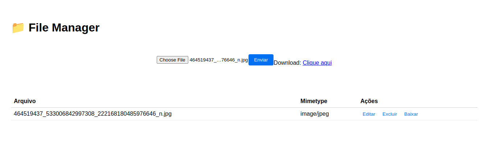

# Pagina Principal

Esta é a pagina principal:

Tendo em vista os eventos que haverão nessa página, usando `cypress` será testado todas as funcionalidades visiveis para
o usuário, novamente será usado mock para não ser necessario acessar API em produção ou desenvolvimento. A fim, de simular
o comportamento do frontend diante de um backend. Dessa forma, duas equipes podem concluir as implementações, sem depeder uma
da outra.